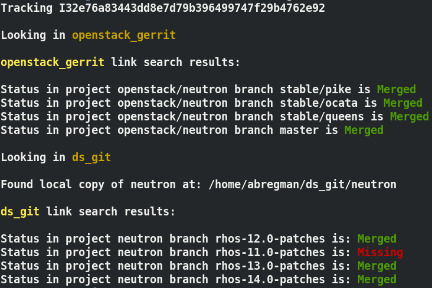

# Commtrack

Tracking commits was never easier.

<div align="center"></div><hr />

## Installation

```
git clone https://github.com/bregman-arie/commtrack.git
cd commtrack
pipenv install -e .
```

## Usage

```
# Search for comit 2142

commtrack -c 2142

# Search for change ID in OpenStack Gerrit:

commtrack --changeid t3gq2 --links openstack_gerrit
```

## User Guide

Would like to learn more about Commtrack? Click [here](docs/user_guide.md)

## Developer Guide

Would like to assist with Commtrack development? Click [here](docs/developer_guide.md)
